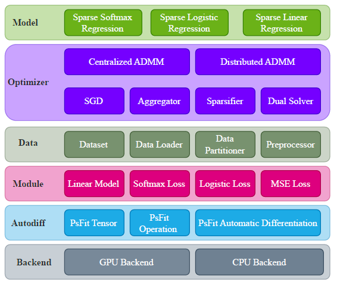

#### Parallel Sparse Fitting Toolbox (PsFiT)
<p align="center">
  
</p>

***

**PsFiT** is an open-source Python framework for distributed sparse model training, designed for scalability and 
optimized with GPU support. Using the DISADMM algorithm, PsFiT enables efficient L0-norm constrained learning
for tasks like linear and logistic regression across multiple nodes.

### Features
- **Distributed Sparse Model Training**: Efficient L0-norm constrained learning across multiple nodes.
- **Scalability**: Optimized for single-node and multi-node setups, with GPU acceleration.
- **Flexible Model Support**: Includes modules for linear regression, logistic regression, and softmax regression.
- **User-Friendly API**: Intuitive APIs for easy integration and customization.

***

### Architecture
<p align="center">
  
</p>

<table>
  <tr>
    <th>Module</th>
    <th>Description</th>
  </tr>
  <tr>
    <td><strong>Model</strong></td>
    <td>Pre-built models for sparse regression tasks, including softmax, logistic, and linear regression.</td>
  </tr>
  <tr>
    <td><strong>Optimizer</strong></td>
    <td>Optimization tools, including centralized/distributed ADMM, SGD, and dual solvers.</td>
  </tr>
  <tr>
    <td><strong>Data</strong></td>
    <td>Manages data loading, partitioning, and preprocessing for distributed training.</td>
  </tr>
  <tr>
    <td><strong>Module</strong></td>
    <td>Components like loss functions specific to different regression tasks.</td>
  </tr>
  <tr>
    <td><strong>Autodiff</strong></td>
    <td>Automatic differentiation with PsFiT tensors for gradient-based optimization.</td>
  </tr>
  <tr>
    <td><strong>Backend</strong></td>
    <td>Supports GPU and CPU environments for flexible deployment.</td>
  </tr>
</table>

***

### Dependencies

- **numpy**
- **ray**
- **torch**
- **scikit-learn**

### Installation
```bash
pip install psfit
```

### Basic Usage

#### Distributed Sparse Softmax Regression for Image Classification with MNIST

Necessary imports
```python

import ray

ray.init(log_to_driver = True)
```

Loading data

```python
import psfit as pf

dataset_path = "path/to/mnist-data.npz"


# create mnist dataset
mnist = pf.MNIST(filename = dataset_path, preprocessor = pf.ImageNormalizer(), cv = True, cv_size = 0.2)

n_vars, n_classes = mnist.number_of_features, mnist.number_of_classes


# create data partitioner
num_workers = 4

partitioner = pf.DataPartitioner(dataset = mnist, N = num_workers)

# create data partitions
partitions = partitioner.partition()

# create a parameter-server with a sparsification strategy
k  = n_vars // 10
server = pf.create_parameter_server(aggregators = pf.ProjectionSparsifier(density = k))

# create worker configurations
for worker_id in range(num_workers):
    worker_config = pf.WorkerConfig(
        worker_id = worker_id,
        batch_size = 64,
        random_seed = (worker_id + 1) * 101,
        loader_report = False,
        model_size = (n_vars, n_classes),
        sgd_lr = 0.05,
        local_epochs = 2,
        local_optim_report = False
    )
    
    server.add_worker_config(config = worker_config)
    

# create worker nodes
workers = []
for worker_id in range(num_workers):
    dataset = partitions[worker_id]   # local dataset

    loss = pf.SoftmaxLoss() # local loss function

    worker = pf.create_worker(worker_id = worker_id,
                           local_dataset = dataset,
                           local_loss = loss,
                           server = server)

    workers.append(worker)

# create distributed optimizer
optimizer = pf.DistributedDataParallel(workers = workers, server = server)

# execute training loop
rounds = 10
for _ in range(rounds):
    optimizer.step(penalty = 2.0)
```

### Examples

More examples are provided in [examples](./examples) directory.


### Benchmarks

Benchmarks are provided in [benchmarks](./benchmarks) directory.


